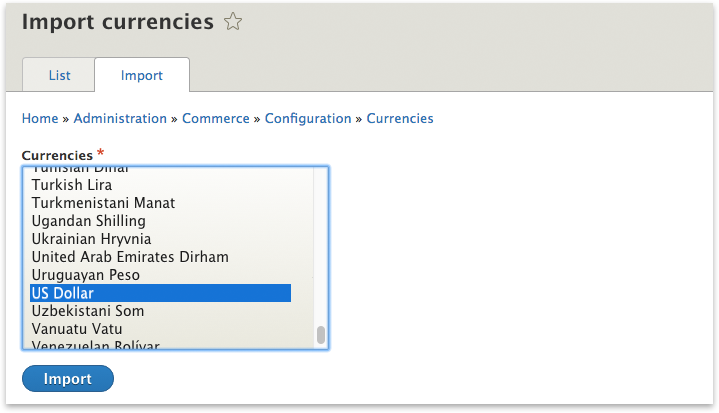
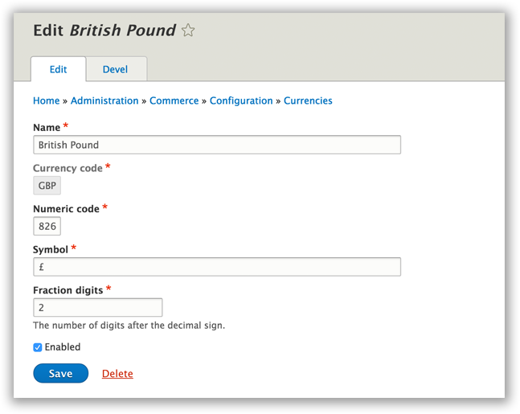

! This piece of documentation needs clarifications to make it friendlier for end users. And technical aspects should be put in a document in the Developer Guide

See Also: [Internationalization Commerce Story] | [Internationalization Library]

## Overview

Commerce without borders means we support every language and every
denomination of currency. This is a big undertaking because not only do
we need to support various currencies, we need to support their regional
formatting rules, what each currency is called in every other language,
and many other difficult problems.

Commerce 2’s currency support is built upon the [commerceguys/intl]
library which provides a list of currencies, currency formatting,
countries, and languages. This list in not something we cooked up on the
back of a napkin, the intl library uses the internationally-recognized
standard of [CLDR] data. We parse the CLDR definitions into our own
more compact YAML definitions and use them to re-implement intl’s
NumberFormatter and provide currency, country, language data.

## Importing Defined Currencies

If you navigate to `admin/commerce/config/currency` and click on the
“Import” tab, you will see a simple dropdown that shows you all the
supported currencies (157 active currencies).

When imported, a configuration entity called “commerce_currency” is
created with all the relevant data from the CLDR definition. Once
imported, the configuration entity is unique to your installation, which
means you can make minor changes to formatting and not worry about an
update reverting your changes.

Also, thanks to the CLDR dataset, we import all the translations of the
currency you are importing for all the languages you have in your site.
A small, but very practical and helpful time saver.

## Creating and Editing Currencies

Once imported (or if you click “+ Add a new currency”) you can change
the name, the numeric code, the symbol and how many minor units we use
in calculations and display

[Internationalization Commerce Story]: https://drupalcommerce.org/blog/15916/commerce-2x-stories-internationalization
[Internationalization Library]: https://github.com/commerceguys/intl
[commerceguys/intl]: https://github.com/commerceguys/intl
[CLDR]: http://cldr.unicode.org/
