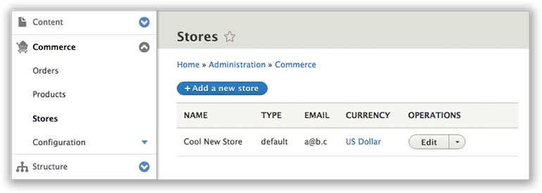

! This needs review about technical details and information useful for end users.

For Commerce 2, we have native support for stores. Stores are used for
invoicing, tax types, and any other settings necessary for understanding
orders. This has many applications, and it's important to understand what
use cases are supported out of the box and how that impacts checkout and
other order workflows.

## Create a store

To create a store you will need to have at least one currency imported,
and then you can create a store.

>  **Shortcut!** - The getting started process can be quickly done using Drupal Console command:  `drupal commerce:create:store`. *You are welcome to ignore this shortcut if you prefer the user interface.*
>  

### Import the currencies your store will use.

The most basic piece of information that defines your store is the
currency(s) you want to use. The vast majority of
Commerce stores will simply have one currency and one store. To set this
up, first you need to locate the currencies page at
``admin/commerce/config/currencies``

Next, click the **Import** tab
(``admin/commerce/config/currency/import``). The reason currencies need
to be imported is because we don’t want to store all the world’s
currencies in your database if we don’t have to, so we make no
assumptions and let each store request specific access to specific
currencies. The dataset is coming from the ``intl`` library, which
generates its dataset from an international and frequently updated
standards body.

Once you’ve imported one or more currencies, you can move on to creating
a store.

## Create a store.

Next, we need to create a store. Every product requires one store.
Additional details will be shared about the power of
having stores baked into the core of Commerce, but for now, all you need
to do is define your store’s name, address, and select a few things
about taxes and billing.

Once you’ve got all those details filled out, click save and move on to
creating products! Woohoo!

## Overview & Architecture

**Orders** will only ever have one store, and it is stored as an entity
attribute.

-  Carts (which are Orders with additional functionality) can only
   contain products from one store.
-  You can use this architecture to limit which products can be put into
   carts together, based on physical location or for billing/taxes
   purposes.

**Products**, by default, have an entity reference field that targets
stores and allows one or more stores to be selected.

**Stores** are fieldable content entities (not configuration entities)
that contain a lot of information about the physical location of the
merchant. By default stores collect the following:

-  Name
-  Email Address
-  Default Currency
-  Address (used for determining taxes)
-  Supported billing countries
-  Owner
-  Default status (used to select a store when one isn’t given)
-  Tax information

## Use Cases

We optimize for the two use cases:

1. One business that has one or more locations **or** 2. The marketplace model (where you have sellers)

For these use cases and possibly others, it is up to the developer to
fill in the gaps that are present in the order workflow. This is
different from Commerce 1.x in that we will support stores by default,
allowing for community contributions to extend the functionality instead
of trying to build store functionality from scratch.

#### One or more locations

This is the most common eCommerce situation where we have a single
person, company, or organization that is taking payments online.

#### Marketplace model

The marketplace model is where you have many sellers who are taking
payment for unique products.

## Stores and Carts

A customer can have one or more Carts (which are a type of Order), if
they have chosen a product from different stores.
