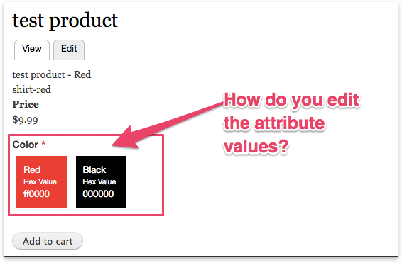
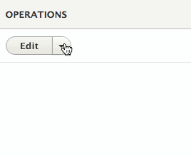
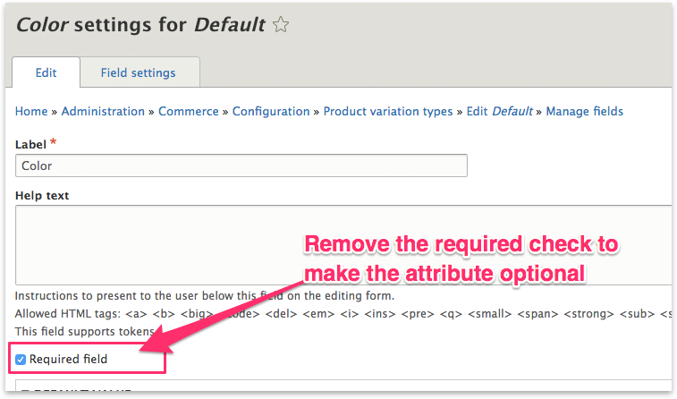

! We need help filling out this section! Feel free to follow the *edit this page* link and contribute.

Imagine you need to sell a DrupalCon t-shirt. This t-shirt comes in
different sizes and colors. Each combination of size and color has its
own SKU, so you know which color and size the customer has purchased and
you can track exactly how many of each combination you have in stock.

!! @todo, the above is too technical for this guide section.

Color and size are product attributes. Blue and small are product
attribute values, belonging to the mentioned attributes. The combination
of attribute values (with a SKU and a price) is called a product
variation. These variations are grouped inside a product.

Creating Attributes and their Values
------------------------------------

For our t-shirt we need two attributes: color and size. Let's start by
creating the color attribute. Go to
``admin/commerce/product-attributes`` and click the Add product attribute link.

After you have created the color attribute, we need to define at least
one value. Normally we would simply say the color is "blue" or "red" but
sometimes you might need to further define the attribute using fields.
Adding fields is covered in detail later on in the documentation.

The product attribute values user interface allows creating and
re-ordering multiple values at the same time and a very powerful
translation capability:

Next, you will need to add the attribute to the product variation type.
You can find these at ``/admin/commerce/config/product-variation-types``
and you just need to add/edit a product variation type that requires
your new attribute.

After you have added "Color" and the various colors your t-shirts are
available in, the next step is to add that "color" attribute to our
product. Store administrators can do this on the product variation type
form, the checkbox in the last step automatically created entity
referenced fields as needed:

Adding fields to Attributes
---------------------------

Product attributes are so much more than a word. Often times they
represent a differentiation between products that is useful to call out
visually for customers. The fieldable attribute value lets the
information architect decide what best describes this attribute. Like
any other fieldable entity, you can locate the list of attribute bundles
and click edit fields:

``/admin/commerce/product-attributes``

Add a field as you would expect. Most fields are supported and will
automatically show up when you go to add attribute values:

Editing Attributes
------------------

Editing the attribute values is pretty easy. Simply locate the attribute
type that has the values you want to edit:
``/admin/commerce/product-attributes`` And click "edit" and you will be
taken to a screen to edit all the attributes of that type.

Optional Attributes
-------------------

After creating attributes, the product variation type needs to know that
it uses the attribute. The product variations are at
``/admin/commerce/config/product-variation-types`` and once you've
clicked on the attribute you want...

Fields are added to the variation type that can then be modified. By
default, all attribute fields are required. If your attribute is
optional (perhaps some of the drupalcon t-shirts only come in blue),
then you can locate the manage fields of your particular product
variation type and make the ``color`` attribute optional by following
these steps:

1. Go to ``/admin/commerce/config/product-variation-types``
2. Click the drop down next to the variation type you want and click
   "manage fields" 
   
   !! @todo image broken
   
   
3. Un-select the "required" checkbox to make the attribute optional.

