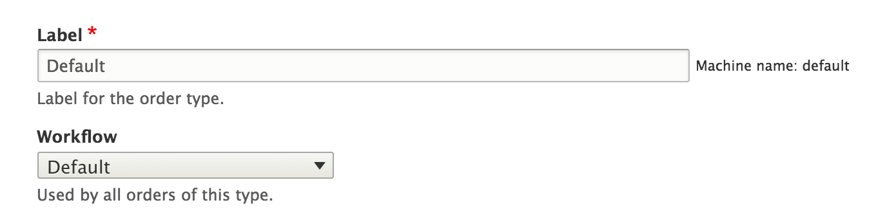
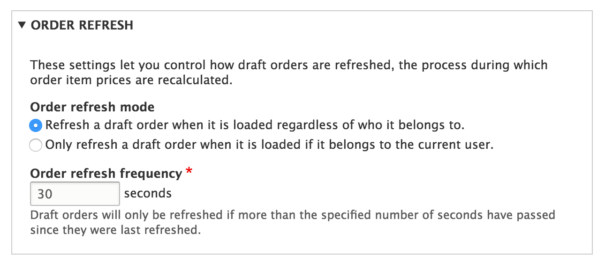
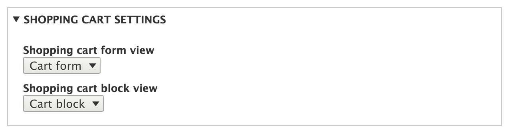
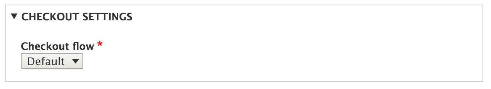

Order types cho phép bạn điều khiển cách mà đơn hàng tương tác với các
thành phần của Drupal Commerce, và cách mà đơn hàng được xử lý trong hệ
thống.

Đơn hàng có workflow cụ thể là xác định những state và transitions
nào mà đơn hàng có thể chuyển vào. Mỗi loại đơn hàng có những quy trình công 
việc riêng của nó

Điều này có nghĩa  là kiểu đơn hàng mặc định của bạn, kiểu đơn hàng có 
sản phẩm có thể vận chuyển được, có thể sử dụng Workflow "Fullfillment".
Trong khi đó, các loại hàng hóa kỹ thuật số có thể có kiểu workflow đơn giản 
hơn: 'Default workflow'

Mỗi loại đơn hàng có thể điều chỉnh các cài đặt refresh của nó để 
kiểm soát mức độ thường xuyên mà thông tin đơn đặt hàng được
xử lý. Việc này điều khiển [xử lý refresh 
order.](../03.order-processing)

Module giỏ hàng cho phép mỗi loại đơn hàng điều chỉnh view mặc định được sử dụng khi 
xuất thông tin giỏ hàng trong block giỏ hàng hoặc form giỏ 
hàng

Bạn có thể sử dụng những luồng thanh toán khác nhau cho mỗi loại đơn
hàng. Trong trường hợp này bạn sẽ có một đơn hàng vật lý sử dụng nhiều
bước thanh toán theo luồng mà yêu cầu thông tin shipping. Một đơn hàng điện tử
có thể có luồng thanh toán đơn giản hơn mà chỉ có một bước (ví dụ: payment.)
