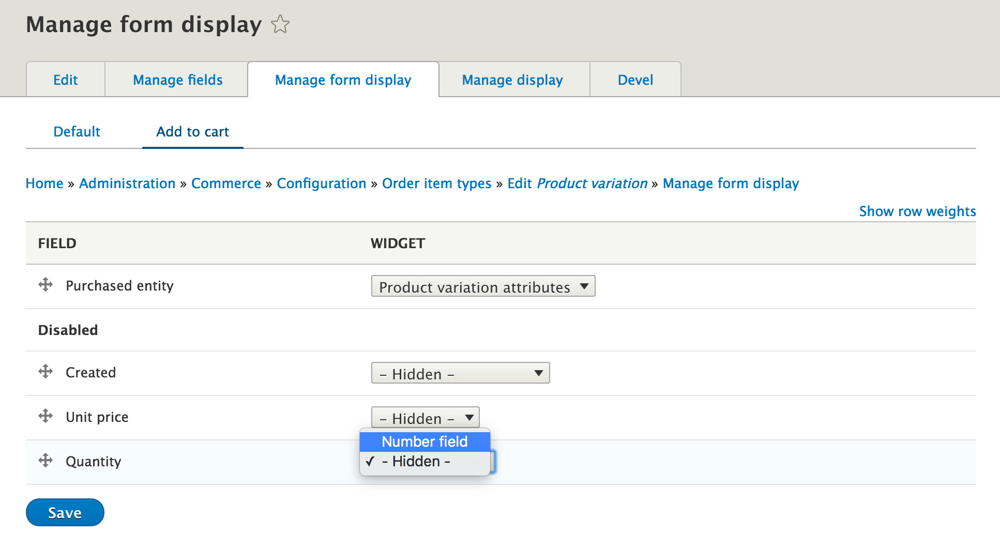

Một order item đại diện cho một sản phẩm có thể mua được trong
đơn hàng. Nó bao gồm tham chiếu tới sản phảm có thể mua được,số
lượng, giá cũa sản phẩm và tổng giá tiền
 
> **Note:** Trong Drupal Commerce 1.x, Order item đã từng được gọi là line items

Tổng tiền của đơn hàng dựa trên giá tiền mặt hàng nhân với số lượng và cộng tất
cả các mặt hàng lại với nhau

Order items have their unit price calculated during the [order refresh process](../03.order-processing). This synchronizes the price with the
current purchasable entity’s price while the order is still in a draft state.

Order items có giá riêng được tính dựa vào [order refresh process](../03.order-processing)
. việc này đồng bộ giá với
 giá các sản phẩm có thể mua được trong khi đơn hàng vẫn trong state
 draft.

The add to cart form is actually the create form for an order item
entity. It is a specific form display. Selecting attributes on the add
to cart form identifies the proper reference purchased entity to
reference.

Việc thêm vào giỏ hàng thực chất tạo một form cho entity order item. Nó là
một form hiển thị củ thể. Chọn các thuộc tính trong form add to cart xác định 
xác định đúng đối tượng tham chiếu đã chọn để tham chiếu.

