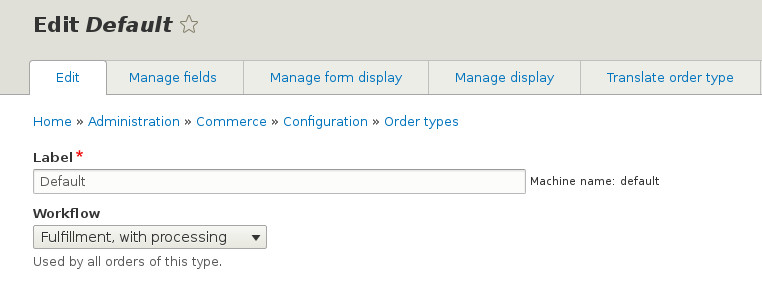
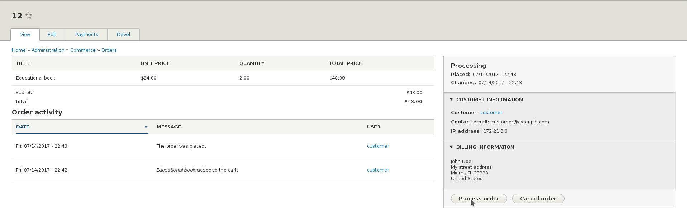
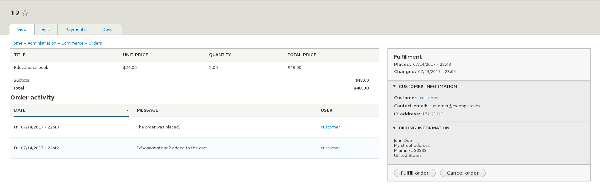

Trong nhiều trường hợp, workflow mặc định của đơn hàng có thể không cung cấp state và transitions phù hợp với các quy trình hoạt động của cửa hàng. Commerce 2 cho phép lập trình viên tạo một workflows để phù hợp với yêu cầu riêng.

In this tutorial we show you how to create a custom workflow, building on top of the Fulfillment workflow provided by the Commerce Order module. Let's suppose that processing and fulfilling an order are two separate steps for our store. This could be because different staff process the order e.g. verify payment and check availability, and different staff packages and ships the products.

Trong bài hướng dẫn này chúng tôi sẽ cho bạn thấy cách để tạo một custom workflow, xây dựng trên workflow fulfilment được cung cấp bởi module commerce order. Giả sử rằng xử lý và hoàn thành đơn hàng là 2 bước khác nhau cho cửa hàng của chúng ta. Điều này là có thể vì có nhân viên chịu trách nhiệm xử lý đơn hàng (ví dụ: xác minh thanh toán và kiểm tra tính khả dụng), và nhân viên khác làm phần đóng gói và chuyển phát sản phẩm.

Định nghĩa một Workflow
-------------------

Một order workflow được định nghĩa bằng file cấu hihn2 Yaml trong một module tự tạo hoặc module cộng  đồng, hãy gọi module này là ``my_module``. Vậy file nên có tên là ``my_module.workflows.yml`` và nó nên được tạo ở file gốc của module. Drupal Commerce sẽ tự động phát hiện file và load workflows được định nghĩa trong đó, sau khi bạn clear caches.

Hãy nhìn qua định nghĩa cơ bản của fulfillment workflow trong file ``commerce_order.workflows.yml``. Chúng ta sẽ thêm state Processing và chỉ định đơn hàng nên chuyển từ state Draft, đến Processing ,đến Fulfillment, và cuối cùng là state Completed.

Group key trong định nghĩa nên luôn có giá trị "commerce_order".

```yaml
    // my_module.workflows.yml

    my_module_fulfillment_processing:
      id: my_module_fulfillment_processing
      group: commerce_order
      label: 'Fulfillment, with processing'
      states:
        draft:
          label: Draft
        processing:
          label: Processing
        fulfillment:
          label: Fulfillment
        completed:
          label: Completed
        canceled:
          label: Canceled
      transitions:
        place:
          label: 'Place order'
          from: [draft]
          to: processing
        process:
          label: 'Process order'
          from: [processing]
          to: fulfillment
        fulfill:
          label: 'Fulfill order'
          from: [fulfillment]
          to: completed
        cancel:
          label: 'Cancel order'
          from: [draft, processing, fulfillment]
          to:   canceled
```

Liên kết kiểu đơn hàng với Workflow
--------------------------------------------

Once the workflow is registered, we need to associate an order type with it. We will assume that we use the default order type for this example. Visit ``/admin/commerce/config/order-types`` and select to Edit the default workflow. Use the workflow dropdown to choose the "Fulfill, with processing" option.

Khi workflow đã được đăng ký, chúng ta cần liên kết kiểu order với nó. Giả sử rằng chúng ta sử dụng kiểu đơn hàng mặc định cho ví dụ này. Vào trang ``/admin/commerce/config/order-types`` và chọn Edit the default workflow. Sử dụng workflow dropdown để chọn option "Fulfill, with processing".



On a production site you may want to export the Order Type as configuration and that would contain its workflow association as well - see [Managing your site's configuration](https://www.drupal.org/docs/8/configuration-management/managing-your-sites-configuration).

Kiểm thử kết quả
------------------


Khi workflow đã được đăng ký và đã được liên kết đến kiểu order, người quản lý cửa hàng có thể chuyển đơn hàng sang các định nghĩa state thông qua các định nghĩa transitions. Thử một đơn hàng và vào trong trang admin. Đơn hàng nên được tự động đặt state là Processing và bạn có thể chuyển state sang Fulfillment  bằng cách vào nút "Process order" (cho biết rằng đơn hàng đã được xử lý), và chuyển sang state Completed khi click vào nút "Fulfill order".

Bạn cũng có thể hủy đơn hàng ở bất cứ bước nào, như định nghĩa trong transition của workflow.




