! Tài liệu này cũng bao gồm quản lý đơn hàng và xử lý chung.

## Liên kết kiểu order vời một Workflow.

An order type can be associated with a specific workflow, and that forces the order to follow that workflow's rules such as to only move through the defined transitions. To associate an order type with an order workflow, go to ``/admin/commerce/config/order-types`` and select to Edit the desired order type. You can then choose the desired workflow from the Workflow dropdown field. Save the form.

Một kiểu đơn hàng có thể liên kết với workflow riêng, và điều này ép đơn hàng phải theo luật của workflows như là chỉ di chuyển thông qua các transitions đã được định nghĩa. Để liên kệt một kiểu đơn hàng với đon hàng workflow, vào ``/admin/commerce/config/order-types`` để chỉnh sửa loại đơn hàng mong muốn. Bạn có thể chọn workflow mong muốn thông qua trường Workflow dropdown. Lưu form này lại.

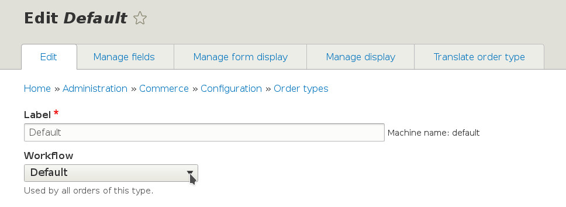

Thay đổi Order Workflow
===========================

Loại đơn hàng có thể có các kiểu workflows khác nhau dựa vào loại sản phẩm mà cửa hàng bạn đang bán và nếu sản phẩm có thể vận chuyển được v.v. Workflow mặc định của đơn hàng có 2 trạng thái, Draft và Completed. Tuy nhiên, nếu bạn chạy đang điều hành một cửa hàng lớn với sản phẩm có thể giao được, Workflow "Fulfillment, with Validation" có thể là thứ phù hợp nhất mà bạn cần.

Bạn có thể thay đổi kiểu workflow của đơn hàng bằng cách vào `/admin/commerce/config/order-types`. Sau đó, chọn kiểu đơn hàng bạn muốn thay đổi và click "Edit". Bây giò, bạn có thể thay đổi workflow bằng cách chọn "Fuilfillment, with validation" từ select list `Workflow`.

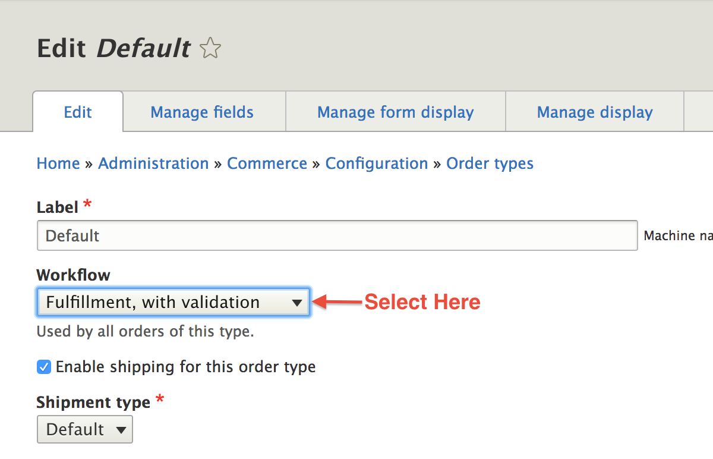

Hãy xem thử cách làm việc của workflow này

## Order Fulfillment with Validation Workflow

Với workflow Fulfillment, with validation, quá trình xử lý  diễn ra theo vòng tròn sau:

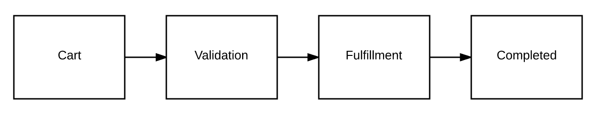

Bắt đầu với đơn hàng đang trong giỏ hàng, đang ở state Draft/Cart, sau đó, khi đơn hàng đã được đặt, nó được đặt vào state Validation. Khi bạn đã sẵn sàng để ship hàng, đơn hàng được chuyển sang state fulfillment. Và cuối cùng, một khi hàng đã rời khỏi cửa hàng, đơn hàng chính thức hoàn thành (state Completed)

Bây giờ bạn đã hiểu tiến trình, hãy xem thử làm cách nào để bạn có thể tạo những đơn hàng thay cho khách hàng và di chuyển chúng theo vòng xử lý đơn hàng

Creating an Order
-----------------

Site admin có thể tạo đơn hàng thay cho khách hàng của họ bằng cách vào ``/admin/commerce/orders/add``. Từ đây, bạn có thể tạo một đơn hàng mới cho những khách hàng cũ (chọn từ khung search autocomplete). Hoặc bạn cũng có thể tạo một khách hàng mới ngay lập tức bằng cách cung cấp địa chỉ email. 
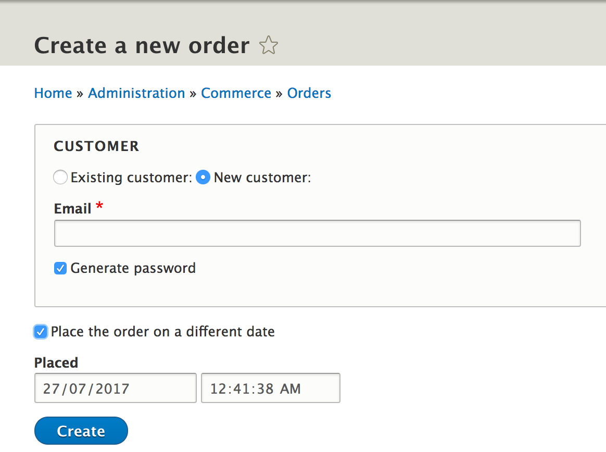

**Note:** Bạn cũng có tùy chỉnh để tạo đơn hàng có ngày khác.

Khi bạn đã có những lựa chọn thích hợp, bạn sẽ được đưa đến trang tạo đơn hàng nơi mà bạn nhập thông tin đơn hàng và sản phẩm trong đơn hàng.

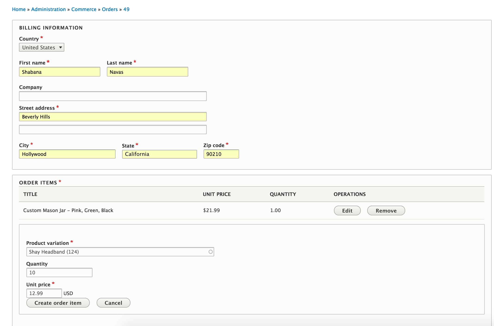

Khi bạn di chuyển xuống dưới, bạn sẽ thấy có một vùng "Adjustments". Đây sẽ là nơi mà bạn thêm khuyến mãi, thêm giá shipping, thêm thuế và các loại giá trị ảnh hưởng đến tổng giá trị đơn hàng. ([See steps on creating a promotion](../../../06.product-merchandising/01.create-promotion))

 Và cuối cùng, bạn có thể thêm coupon vào đơn hàng. ([See steps on creating a coupon](../../../06.product-merchandising/02.create-coupon))

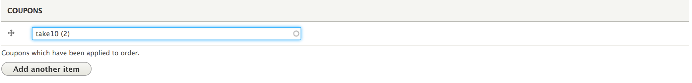

Nếu bạn đã có khuyến mãi đang chạy, việc này sẽ tự động được ánh xạ sang giá của sản phẩm và tổng tiền của đơn đặt hàng.

Lưu một đơn hàng
---------------

Bây giờ sau khi bạn đã thêm toàn bộ chi tiết dơn hàng, hãy lưu đơn hàng. Bạn sẽ tùy chỉnh cho việc lưu đơn hàng mới này xuống giỏ hàng. Điều này sẽ tự động thêm sản phẩm trong đơn hàng này đến giỏ hàng nên bạn có thể hoàn thành thanh toán bằng cách đến ``/cart``.

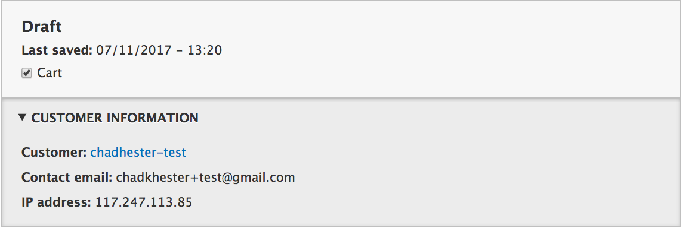

Now, click to view the order. Notice that a discount has been automatically applied to the order total as there was a "20% Off" promotion running store-wide. Also, notice that the order is currently in `Draft` state.

Bây giờ ấn vào view the order. Lưu ý coupon sẽ được tự động áp dụng cho tổng đơn hàng và đang có một chương trình khuyến mãi 20% chạy khắp cửa hàng. Lưu ý thêm, đơn hàng đang trong state Draft.

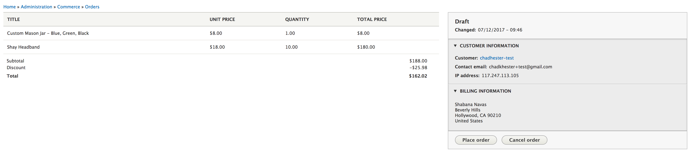

Thêm thanh toán
----------------

Là admin, khi bạn dẵ hoàn thành xong các chi tiết đơn hàng, việc tiếp theo sẽ là hoàn thành thanh toán trong đơn hàng. Đó là nơi mà tab Payment được đưa vào. Trang Payments cho phép chúng ta xử lý Credit Card/Email Chuyển tiền/Bank Transfer/Cheque payment giúp cho đơn hảng sử dụng payment gateway của cửa hàng.

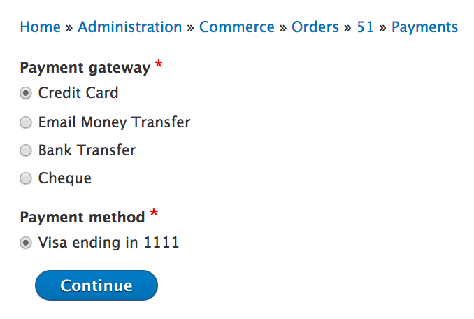

Now, that you've got money for the goods from the customer, let's go ahead and officially place the order by clicking on the "Place order" button. This will put the order in `Validation` state.

Bây giờ, bạn đã nhận được tiền cho hàng hóa từ khách hàng, hãy tiếp tục bằng cách chính thức đặt hàng bằng cách nhận nút "Place order". Điều này sẽ chuyển state đơn hàng sang `Validation`.

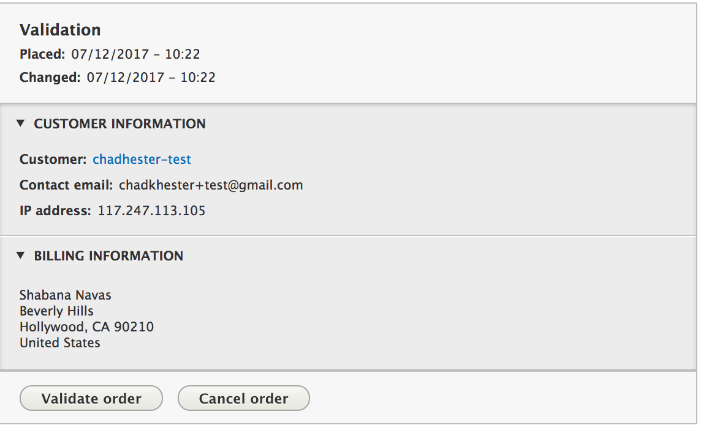

Hoàn thành đơn đặt hàng
--------------------

Bước tiếp theo khá là hiển nhiên, khi bạn đã sẵn sàng để chuyển hàng, bạn phải click vào nút "Validate Order" và đơn hàng của bạn sẽ chuyển sang trạng thái `Fulfillment`.

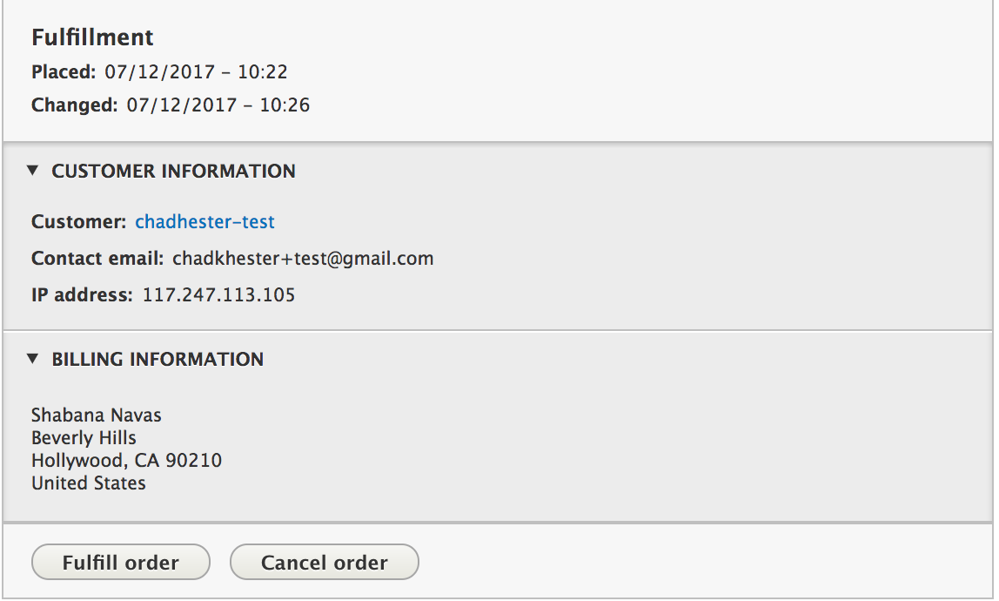

And finally, once the order has shipped out, you can hit the "Fulfill Order" button and the order enters `Completed` state.

Và cuối cùng, khi đơn hàng đã được chuyển đi, bạn có thể ấn nút "Fullfill Order" và đơn hàng đã vào state `Completed`

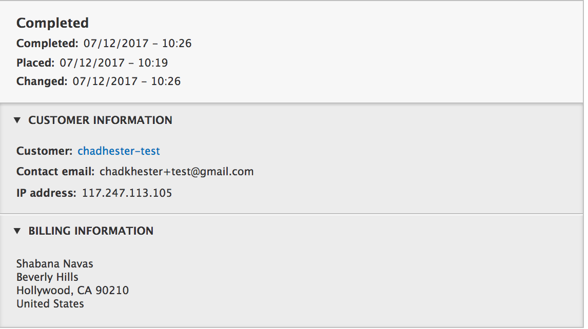
